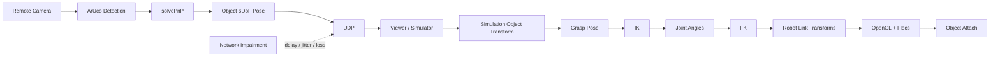

# PoseLink

PoseLink는 **원격 카메라가 인식한 물체의 6DoF Pose를 시뮬레이터로 전송하고, 가상 다관절 로봇팔이 해당 물체의 grasp pose를 계산해 집는 과정을 재현하는 C++ 프로젝트**다.

현재는 로봇 제어를 바로 구현하지 않고, 입력 Pose가 Viewer의 `Transform`으로 전달되어 정확히 렌더링되는 가장 작은 수직 경로부터 검증한다. 이후 UDP, 실제 Vision, 로봇 모델, FK/IK를 단계적으로 연결하고 마지막에 network jitter/loss가 target pose와 grasp 안정성에 미치는 영향을 측정한다.

## 현재 상태

현재 작업 기준 완료 단계는 **1. Synthetic Pose → Cube**다.

| 단계 | 상태 | 목표 |
|---|---|---|
| 1. Synthetic Pose → Cube | ✅ 완료 | 결정적인 6DoF 입력이 Viewer `Transform`과 렌더링까지 전달되는 경로 검증 |
| 2. UDP Object Pose | ▶ 다음 | Pose를 별도 process 사이에서 전송 |
| 3. ArUco Object Detection | 예정 | 원격 카메라에서 known object의 6DoF Pose 추정 |
| 4. Simulation에 Object 생성 | 예정 | 수신 Pose로 가상 물체 배치 |
| 5. Robot Model 추가 | 예정 | 다관절 로봇 모델과 joint/link 구조 구성 |
| 6. FK 구현 | 예정 | joint angle에서 각 link/end-effector pose 계산 |
| 7. Grasp Pose 정의 | 예정 | object frame에서 end-effector가 도달할 목표 pose 정의 |
| 8. IK 구현 | 예정 | grasp pose를 만족하는 joint angle 계산 |
| 9. End Effector → Grasp Pose 추종 | 예정 | 움직이는 target에 대한 kinematic tracking |
| 10. Grasp 성공 시 Object attach | 예정 | 성공 조건을 만족하면 object를 end-effector에 부착 |
| 11. Network jitter/loss 실험 | 예정 | 지연·지터·손실이 target/grasp 안정성에 미치는 영향 측정 |

## 최종 시스템 흐름



초기 grasp 범위는 **known object + known grasp offset + kinematic grasp**로 제한한다. 물리 기반 접촉, 충돌 회피 motion planning, 임의 형상에 대한 grasp planning은 기본 완료 범위가 아니다.

## 현재 코드 구조

```text
apps/
├─ viewer/            # 현재 build되는 OpenGL Viewer
└─ vision_node/       # 향후 camera/synthetic sender 실행 프로그램

modules/
├─ common/            # Pose domain type
├─ vision/            # Synthetic / ArUco Pose source
├─ transport/         # UDP / protocol 예정
├─ streaming/         # receiver / buffer 예정
└─ viewer/
   ├─ components/     # Transform, Renderable
   ├─ systems/        # RenderSystem
   └─ graphics/       # Window, Camera, Renderer, Mesh, Shader ...
```

Viewer는 `flecs::world`를 소유하고, `RenderContext`를 world context로 등록한 뒤 `RenderSystem`을 Flecs module/system으로 실행한다. `world.progress(dt)`가 등록된 system을 frame pipeline에서 실행하며 `Renderer`는 ECS나 Pose source를 직접 소유하지 않는다.

## 빠른 빌드

현재 CMake에서 실제로 구성되는 실행 파일은 `poselink_viewer`다. OpenCV, UDP sender/receiver, robot kinematics target은 아직 CMake에 연결되어 있지 않다.

요구 사항:

- C++17 compiler
- CMake 3.20+
- OpenGL development environment
- 최초 configure 시 GLFW, GLM, Flecs를 가져올 네트워크 연결

```bash
cmake -S . -B build -DPOSELINK_BUILD_GRAPHICS=ON
cmake --build build --config Release
```

실행 경로와 shader working directory는 generator에 따라 다르다. 자세한 내용은 [빌드 및 실행](docs/build-and-run.md)을 따른다.

## 설계 원칙

- `Pose`는 Vision/Network domain data이고 `Transform`은 Viewer data로 분리한다.
- Vision Node는 headless producer로 유지하며 OpenGL/Flecs를 의존하지 않는다.
- Viewer에서만 Flecs와 OpenGL을 사용한다.
- FK를 먼저 검증한 뒤 IK를 구현한다.
- 물체 자체의 Pose와 실제로 잡아야 할 `grasp pose`를 구분한다.
- 네트워크 robustness는 로봇 grasp 경로가 먼저 완성된 뒤 마지막 단계에서 측정한다.
- 구현되지 않은 기능은 문서에서 `예정` 또는 `설계`로 표시한다.

## 문서

| 문서 | 내용 |
|---|---|
| [Project Background](docs/PROJECT_BACKGROUND.md) | 해결하려는 문제와 프로젝트 범위 |
| [Architecture](docs/ARCHITECTURE.md) | 시스템, 모듈 책임, 데이터 흐름, 로봇 grasp 연결 |
| [Technology Stack](docs/TECH_STACK.md) | 현재/예정 기술과 선택 이유 |
| [Build & Run](docs/build-and-run.md) | 현재 빌드 가능한 target과 실행 방법 |
| [Testing](docs/testing.md) | 로드맵 단계별 검증 방법 |
| [Acceptance Criteria](docs/ACCEPTANCE_CRITERIA.md) | 프로젝트 완료 조건 |
| [Design Decisions](docs/decisions.md) | 주요 설계 결정과 미결정 사항 |
| [Flecs Adoption](docs/FLECS_ADOPTION.md) | Viewer ECS 도입 이유와 현재 실행 구조 |
| [Coordinate System](docs/coordinate_system.md) | Camera/World/Robot/Object/Grasp frame 계약 |
| [Vision Pose](docs/vision_pose.md) | ArUco 기반 known object pose 설계 |
| [Protocol](docs/protocol.md) | UDP Object Pose protocol 설계 초안 |
| [Viewer Interpolation](docs/viewer_interpolation.md) | 마지막 network robustness 단계의 시간축 복원 정책 |
| [Experiments](docs/experiments.md) | jitter/loss 실험 설계 |
| [Platforms](docs/platforms.md) | 현재 dependency와 플랫폼 범위 |
