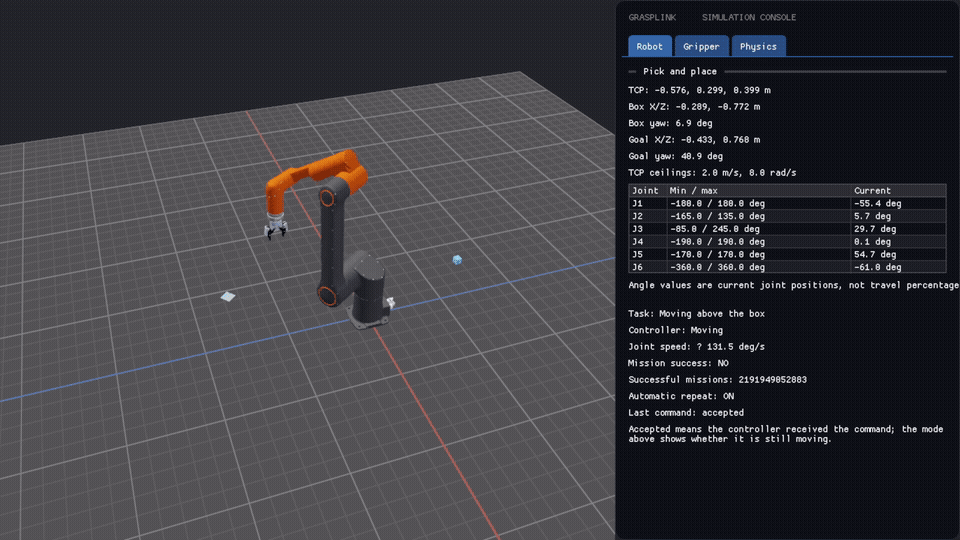

# GraspLink

Hanwha HCR-12A 로봇 팔과 Robotiq 2F-85 그리퍼의 움직임을 살펴볼 수 있는 시뮬레이터입니다. 로봇의 관절 제어와 경로 계획, 물리 기반 장면을 하나의 앱에서 확인할 수 있고, Windows와 웹 빌드를 지원합니다.

## 시연

아래 영상에서 로봇이 물체를 집어 옮기는 과정을 볼 수 있습니다.

[](assets/시연.webm)

원본 영상: [시연.webm](assets/시연.webm) · 16초, 1080p

GraspLink는 C++17, OpenGL, Flecs, Jolt Physics를 사용합니다. 정·역기구학, 관절 공간 이동과 TCP 직선 이동, 충돌 검사, 픽앤플레이스 동작을 구현했습니다. 물체를 집을 때는 양쪽 손끝이 같은 물체에 닿으면 그리퍼와 물체 사이에 고정 제약 조건(constraint)을 연결합니다. 실제 그리퍼의 파지력이나 손가락별 적응 동작을 계산하는 모델은 아닙니다.

이 프로젝트는 시뮬레이션 전용입니다. 실제 로봇에 연결하거나 장비를 제어하지 않습니다. 관절 가속도와 그리퍼 동작에 쓰는 값도 제조사에서 검증한 운전 사양이 아니라 시뮬레이션 설정입니다.

## Windows에서 빌드하기

CMake, Ninja, MSVC가 준비된 Visual Studio Developer PowerShell 또는 x64 Native Tools 명령 프롬프트에서 실행합니다.

```powershell
cmake --preset ninja
cmake --build --preset ninja-debug
ctest --test-dir build-ninja-debug --output-on-failure
```

Release 빌드는 `ninja-release` 설정 preset과 빌드 preset을 사용합니다. 실행 파일이 모델과 셰이더를 찾을 수 있도록 빌드 디렉터리에서 실행하세요.

```powershell
cd build-ninja-debug
.\grasplink_simulator.exe
```

제어 패널에서 그리퍼를 열고 닫거나 픽앤플레이스 작업을 시작하고, 일시 정지·재개·초기화·정지할 수 있습니다. 충돌 표시에는 화면 메시가 아니라 시뮬레이터가 충돌 계산에 쓰는 단순화 형상이 나타납니다.

## 웹 빌드

Emscripten SDK를 설치하고 활성화한 뒤 멀티스레드 웹 빌드를 만듭니다.

```powershell
emcmake cmake --preset emscripten-web
cmake --build --preset emscripten-web
```

결과물은 `build-emscripten-web/index.html`입니다. 런타임과 모델 데이터는 HTML에 포함됩니다. 다만 pthreads 빌드는 브라우저 Worker와 교차 출처 격리(cross-origin isolation)가 지원되는 웹 주소에서 실행해야 합니다. `file://`로 직접 열면 필요한 브라우저 기능을 사용할 수 없습니다. 배포본은 [Portfolio에서 실행](https://cgantro.github.io/Portfolio/minibcg/index.html)할 수 있습니다.

스레드를 지원하지 않는 환경용으로 단일 스레드 빌드도 제공합니다.

```powershell
emcmake cmake --preset emscripten-single-thread
cmake --build --preset emscripten-single-thread
```

## 프로젝트 구조

- `apps/simulator` — 앱 초기화와 메인 루프
- `modules/application` — 픽앤플레이스 작업 흐름
- `modules/robotics` — 로봇 모델, 기구학, Controller 인터페이스
- `modules/simulation` — 장면 Entity와 물리 시뮬레이션 연결
- `modules/physics` — Jolt 물리 월드
- `modules/gui` — 시뮬레이터 제어 패널
- `modules/viewer` — 모델 로딩과 화면 렌더링
- `docs` — 구조, 제어 동작, 모델 데이터, 진단 문서

## 문서

문서 목록은 [문서 안내](docs/README.md)에서 확인할 수 있습니다. 처음 보는 분은 [아키텍처](docs/ARCHITECTURE.md)부터 읽고, 제어 흐름은 [Controller 인터페이스](docs/CONTROLLER_INTERFACE.md), 이동과 파지는 [로봇 이동과 그리퍼 파지](docs/ROBOT_MOTION_AND_GRASP.md), 물리 연동은 [Physics와 Flecs](docs/PHYSICS_ECS_INTEGRATION.md)를 참고하세요.
