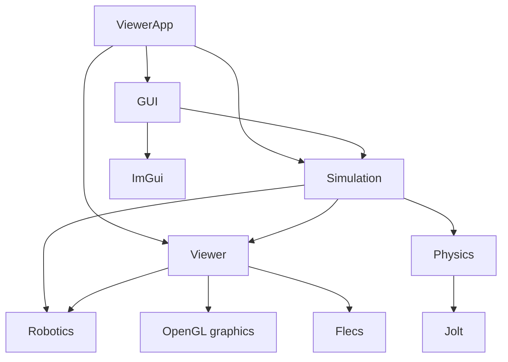

# Architecture

## Module boundaries

```text
modules/
├── robotics/       Robot models, controller contracts, backends, forward kinematics
├── physics/        Jolt wrapper and engine-independent physics types
├── viewer/         Flecs scene, transforms, GLB assets, OpenGL rendering
├── simulation/     Physics ECS integration, robot collision proxies, floor setup
└── gui/            ImGui panels and configured collider visualization
```

Arrows point from a consumer to its dependency. These are the main target dependencies in CMake:



`modules/physics` does not depend on Flecs, Viewer, or OpenGL. Jolt-specific types stay inside that module. `modules/simulation` owns Flecs physics configuration and the private runtime binding between an Entity and `PhysicsBodyHandle`.

## Robot state flow

```text
IRobotController
→ RobotState
→ RobotKinematics
→ RobotKinematicState
   ├── RobotTransformAdapter → GLB Joint Entity transforms
   └── RobotPhysicsAdapter → Kinematic link collision Entities
```

`RobotKinematics` is the shared source of robot pose. It derives parent-relative offsets from consecutive base-frame bind pivots and accumulates joint rotations for the serial chain. Viewer and Physics consume the same result instead of separately interpreting joint axes and angles. Robotics model data uses plain scalar/vector/quaternion types and does not depend on GLM, Flecs, or Jolt.

FK는 모델에 ToolFrame이 있으면 `toolFrameInBaseFrame`을 제공한다. 이 flange/model 기준은 `RobotState::tcpPose`와 별개이며 `SimRobotController`의 `tcpPoseValid`는 false다. IK, `MoveLinear` 실행, 가속도 제한, Hardware Gripper backend와 관절 동역학은 아직 구현하지 않았다.

`RobotTransformAdapter`는 자세를 authored GLB 계층에 적용한다. `RobotPhysicsAdapter`는 연결된 GLB 조각에서 링크별 Convex Hull을 만들며 다음 가동 관절 아래와 Gripper를 제외한다. 삼각형 중심 기준 16 cm 셀을 사용하고 4 cm 미만 부품·1 cm 미만 셀·부피 없는 hull 입력을 제외한다. `ConfigureTwoF85Colliders`는 고정 Gripper 또는 가동 관절 Entity 아래 Gripper-layer Kinematic proxy 7개를 만든다. rigid part마다 이름 있는 GLB 메시의 축약 hull을 사용하며 outer knuckle에는 attached finger 메시도 포함한다. proxy의 Local 원점은 소유 body/joint 원점이다. robot Base collider와 관절 동역학은 없다.

## 그리퍼 상태 흐름

```text
GUI 요청 → IGripperController / SimGripperController
→ GripperState.closureFraction
→ GripperKinematics: master angle / mimic Local rotation
→ GripperTransformAdapter: bind rotation * delta rotation
→ authored GLB 관절 → World 변환 → 기존 7개 Kinematic proxy
```

`GripperState`의 유효한 연속 위치가 개폐 자세의 기준이다. raw 0..255는 요청·표시용이며 반올림한 raw feedback을 기구학 입력으로 다시 사용하지 않는다. 여섯 관절은 분기형이므로 팔의 직렬 FK를 재사용하지 않고 Local 회전 변화만 계산한다. 어댑터는 원본 Local 위치·크기와 Gripper/ToolFrame 장착 변환을 보존한다. raw 위치의 선형 fraction 매핑과 master 속도 기본값 0.1..1.0 rad/s는 시뮬레이션 가정이다. 힘·전류·접촉 판정·접촉 시 정지·파지는 구현하지 않았다. 자세한 계약은 [그리퍼 런타임 설계](GRIPPER_RUNTIME_DESIGN.md)를 참고한다.

`GuiModule`은 ImGui context·GLFW/OpenGL backend와 `BeginFrame/EndFrame`, 입력 capture 조회를 담당한다. `ViewerApp`이 `GripperPanel`, `PhysicsDebugPanel`, `ColliderOverlay`를 별도로 만들고 `BeginFrame → GripperPanel → PhysicsDebugPanel → ColliderOverlay → EndFrame` 순서로 조립한다. `GripperPanel`은 호출 중에만 Controller를 빌려 요청·상태를 표시하고, `PhysicsDebugPanel`은 collider 표시 체크박스 상태를 보관한다. `ColliderOverlay`는 World query와 화면 선 캐시를 소유하며 Camera는 Draw 호출 중에만 빌린다. 선은 Jolt 내부 형상 대신 ECS 설정의 깊이 없는 전경 투영이며, 첫 표시·resize와 100 ms 간격으로 갱신한다.

## Transform and fixed-step flow

`TransformSystemModule::UpdateWorldTransforms()`는 공통 Local-to-World 계산 경로다. 4 ms 고정 tick에서 두 Controller 상태와 팔·그리퍼 자세를 갱신한 뒤 World 행렬, Kinematic 동기화, Jolt step, Dynamic 결과의 Local 반영 순서로 진행한다. step 뒤 World 행렬을 다시 계산하며 렌더 직전에도 갱신한다.

`Rotation, Local`과 `NodeData.rotation`은 `glm::quat`이며 `Entity::GetLocalRotation` / `SetLocalRotation` 및 `ComposeLocalMatrix(position, rotation, scale)`도 quaternion을 사용한다. glTF 배열 `[x,y,z,w]`는 로더에서 GLM 생성자 `(w,x,y,z)`로 옮긴다. `Rotation` 생성과 행렬 합성은 회전을 검증·단위 정규화하며 영 quaternion·NaN·Infinity를 거부한다. `q`와 `-q`는 같은 회전이므로 성분 부호만으로 자세가 다르다고 판단하지 않는다.

팔·그리퍼 FK 결과는 quaternion으로 Entity에 전달한다. Dynamic은 SceneRoot 또는 항등 grouping 조상만 허용해 World≈Local 계약을 사용하므로, Physics 결과의 위치·quaternion을 Local에 직접 저장한다. 부모 역행렬이나 Local 행렬 분해는 하지 않는다. GLB·FK·Physics에서 quaternion과 Euler 사이의 왕복 변환을 제거했다. Entity pose·변환 행렬은 float 정밀도를 유지한다. 제어용 관절각과 각속도는 rad·rad/s 스칼라이며, Orbit 카메라의 마우스 입력용 yaw/pitch도 rad 각도를 사용한다.

```text
FixedControlLoop
→ RobotController + GripperController Update
→ RobotKinematics + GripperKinematics
→ Viewer + Simulation pose adapters
→ TransformSystemModule World transforms
→ PhysicsSystemModule PrePhysicsSync: 설정 재구성 / Scene-driven 목표 전달
→ PhysicsWorld Step
→ PhysicsSystemModule PostPhysicsSync: Physics-driven Dynamic 결과를 Local에 직접 저장
→ TransformSystemModule World transforms 재갱신
→ Render frame: TransformSystemModule / RenderSystemModule
```

Physics는 render FPS와 독립된 고정 간격으로 진행한다. `IsSceneDriven`은 Static·Kinematic, `IsPhysicsDriven`은 Dynamic을 분류한다. Static은 Scene 목표가 바뀔 때만 `SetBodyTransform`을 호출한다. Kinematic은 같은 목표라도 실제 도달 전에는 `MoveKinematic`을 계속하고, 도달 뒤 `StopKinematic`을 한 번 호출해 잔류 속도를 지운 다음 같은 목표의 동기화를 생략한다. 위치·회전이 바뀌면 다시 이동한다.

물리 Entity와 조상은 unit scale을 사용하며 Static Environment 자신의 시각 scale만 예외다. Collider 치수·offset은 m 단위로 직접 지정한다. 모든 Body는 Dynamic 조상을 금지하고, Dynamic 자체는 조상 각각의 변환이 항등이어야 한다. 실행 중 이 scale·부모 계약이 깨지면 binding과 Body를 제거하고, 복구되면 현재 Scene World 자세로 다시 만든다. 공개 pose는 model/Entity 원점 기준이며 compound의 무게중심 보정은 Jolt 내부 책임이다.

## Scene composition and lifetime

`ViewerApp` is the Composition Root. It creates Window, renderer, scene, controller, `PhysicsWorld`, adapters, `PhysicsSystemModule`, and `GuiModule` in dependency order. It owns no per-object creation APIs.

`SimulationSceneBuilder` configures the floor. Application-side `DebugSceneSetup` adds falling boxes and the robot demo command only with `--physics-demo`, in both Debug and Release. `PrefabFactory` builds visual Entities from GLB nodes. A single-primitive Node owns its render components directly; multi-primitive nodes use render child Entities. The GLB loader requires one node tree under the selected scene root and rejects sparse accessors, invalid byte ranges/strides, unsupported matrix transforms, cycles, and multiple parents.

`ViewerApp`은 Flecs World와 PhysicsWorld를 소유한다. `ColliderOverlay`의 World query와 패널을 먼저 해제하고, 어댑터·Scene Entity를 제거한 뒤 Physics integration과 World를 정리한다. Flecs 제거 observer가 Entity의 Jolt Body도 삭제한다. `GuiModule`은 Window의 OpenGL context가 살아 있을 때 backend와 ImGui context를 정리한다.

Scene Entity creation requires an active SceneRoot. `SceneManager` creates the root before `OnEnter`, so constructors must defer Entity creation until activation. Shutdown removes adapters and Scene Entities while physics observers are live, then removes the integration objects and World. `ModelResource` also holds strong GPU Mesh references; it, AssetManager, shaders, and the renderer are released before the Window destroys the OpenGL context.

For more detail on collision layers, transform spaces, scale requirements, and deferred robot-physics work, see [Physics / Flecs Integration](PHYSICS_ECS_INTEGRATION.md).
