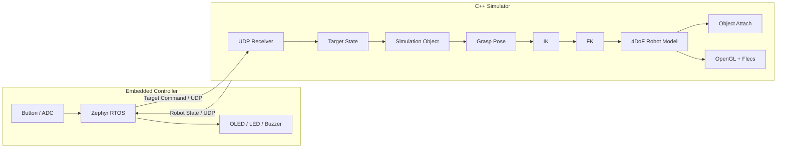

# GraspLink Architecture

## 1. 목적

GraspLink는 **외부 임베디드 장치가 생성한 Target Position을 네트워크로 전달하고, C++ Simulator의 가상 로봇이 해당 목표로 이동해 물체를 파지한 뒤 결과를 다시 외부 장치에 반환하는 시스템**이다.

현재 구현과 목표 구조를 구분하며, 구현되지 않은 항목은 계획으로 취급한다.

---

## 2. 시스템 경계



1차 입력원은 ESP32 + Zephyr Controller다. Camera/ArUco는 이후 동일한 Target Pose 경계에 연결하는 확장 입력원이다.

---

## 3. Robot Arm 모델

1차 프로토타입은 **4DoF serial manipulator + gripper**로 고정한다.

| Joint | Motion | 역할 |
|---|---|---|
| J1 | Base yaw | 로봇 전체를 수직축 기준 회전 |
| J2 | Shoulder pitch | 상완 링크 상하 회전 |
| J3 | Elbow pitch | 전완 링크 상하 회전 |
| J4 | Wrist pitch | End Effector 접근 각도 조정 |
| Gripper | Open / Close | 파지 상태. 4DoF 계산과 별도 actuator/state |

초기 IK의 주된 목표는 target XYZ position이다. J4는 grasp 접근 각도를 맞추는 데 사용하며 임의의 3축 orientation을 모두 만족시키는 full 6DoF pose IK는 범위에 포함하지 않는다.

Robot model asset은 rigid link별 node/pivot가 분리된 hierarchy를 사용한다. skinning animation보다 각 link transform을 FK 결과로 직접 갱신할 수 있는 구조를 우선한다.

---

## 4. 현재 구현 구조

현재 PC 쪽 실제 코드는 OpenGL/Flecs Viewer 기반이다.

```text
ViewerApp
├─ Window
├─ Renderer
├─ Camera
└─ flecs::world
   ├─ RenderContext
   ├─ Entity: Transform + Renderable
   └─ RenderSystem
```

root CMake의 현재 executable 이름은:

```text
grasplink_simulator
```

Embedded 쪽은 `embedded/controller`에 Zephyr application skeleton을 두었다. 정확한 보드 모델과 핀맵을 확인한 뒤 DeviceTree overlay를 추가한다.

---

## 5. Repository 책임

| 영역 | 책임 |
|---|---|
| `embedded/controller` | ESP32 peripheral, Zephyr task/event, Target 생성, UDP 송수신, 상태 UI |
| `modules/common` | Pose/Target/State 등 공통 domain type |
| `modules/transport` | PC UDP socket, encode/decode |
| `modules/streaming` | 최신 상태 적용, sequence/freshness 처리 |
| `modules/viewer` | OpenGL/Flecs scene와 rendering |
| robot kinematics module | 4DoF Robot model, FK, IK, grasp 계산. 실제 구현 시 경로 확정 |
| `modules/vision` | Synthetic 및 향후 ArUco 입력원 |

---

## 6. 핵심 경계

### Embedded와 Simulator

Embedded는 joint angle이나 renderer 내부 구조를 알지 않는다.

```text
Embedded
→ Target Command
→ Simulator
```

Simulator는 GPIO, ADC, OLED 구현을 알지 않는다.

```text
Simulator
→ Robot State
→ Embedded UI
```

### Target Source와 Robot

Robot control은 입력원이 ESP32인지 Synthetic인지 Camera인지 구분하지 않는다.

```text
ITargetPoseSource
├─ SyntheticTargetSource
├─ UdpTargetSource
└─ ArucoTargetSource
```

논리 경계는 다음과 같다.

```text
Target Pose
→ Simulation Object
→ Grasp Pose
→ IK
→ FK
→ Robot Transform
→ Grasp
```

---

## 7. Embedded 실행 흐름

목표 구조:

```text
GPIO ISR / ADC
      ↓
Input Event
      ↓
Target State
      ↓
Network TX
```

반대 방향:

```text
Network RX
      ↓
Robot State
      ↓
Display / LED / Buzzer
```

원칙:

- ISR에서는 최소 작업만 한다.
- OLED와 socket 송수신 같은 무거운 작업은 ISR에서 처리하지 않는다.
- 실제 필요성이 생긴 책임 단위로 thread/work/message queue를 사용한다.
- stale target이 누적되지 않게 최신 상태 우선 정책을 사용한다.

---

## 8. Simulator 실행 흐름

### Target 처리

```text
UDP Receiver
→ Decode
→ sequence/freshness 확인
→ Target State
→ Object Transform
```

### Robot 처리

```text
Object Pose
→ Grasp Pose
→ 4DoF IK
→ Joint Target [q1, q2, q3, q4]
→ FK
→ Link / End Effector Transform
```

### Grasp

초기에는 physics contact가 아닌 kinematic 조건을 사용한다.

```text
position error <= threshold
AND
wrist/grasp alignment error <= threshold
→ grasp success
→ Object Attach
```

---

## 9. Flecs 사용 범위

Flecs는 Simulator scene의 entity/component 관리와 render system scheduling에 사용한다.

```text
Entity
+ Transform
+ Renderable
+ optional robot/object role component
```

FK/IK 계산 자체는 rendering API나 Flecs에 강하게 결합하지 않는다.

---

## 10. 1차 Prototype 순서

1. Synthetic Target Position → Object
2. 4DoF Robot Model
3. FK
4. Grasp Pose
5. IK
6. End Effector 추종
7. Object Attach
8. ESP32 + Zephyr bring-up
9. Button / ADC / OLED Target Controller
10. ESP32 → Simulator UDP Target Command
11. Simulator → ESP32 Robot State
12. RTOS task/event/message 흐름 정리

자세한 4일 작업 순서는 [ROADMAP.md](ROADMAP.md)를 따른다.

---

## 11. 2차 확장

Prototype 이후 다음을 추가한다.

```text
Camera
→ ArUco Detection
→ Object Pose
→ ArucoTargetSource
→ 기존 Robot Pipeline
```

이후 network delay/jitter/loss를 주입하고 다음을 측정한다.

- packet loss
- target age
- stale packet discard
- end-effector target error
- grasp success/failure

IMU는 orientation controller가 필요한 시점에 선택적으로 추가한다.
