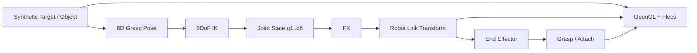

# GraspLink Architecture

## 1. 목적

GraspLink는 **하나의 C++ Simulator process 안에서 HCR-12A 기반 6DoF 로봇팔의 모델링, FK/IK, target 추종, grasp/attach를 구현하고 검증하는 프로젝트**다.

외부 Embedded Controller, UDP 입력, Vision Node는 시스템 경계에 포함하지 않는다.

---

## 2. 시스템 경계



입력은 Simulator 내부에서 생성하는 deterministic target/object state로 시작한다.

---

## 3. Robot Arm 모델

로봇팔은 **HCR-12A 기반 6DoF serial manipulator + 2F85 gripper**로 고정한다.

```text
Base
└─ J1
   └─ Link1
      └─ J2
         └─ Link2
            └─ J3
               └─ Link3
                  └─ J4
                     └─ Link4
                        └─ J5
                           └─ Link5
                              └─ J6
                                 └─ Link6
                                    └─ End Effector
                                       └─ 2F85 Gripper
```

J1~J6은 revolute joint이며 origin/axis/limit는 RobotDescription에서 명시한다. Gripper open/close는 별도 actuator/state다.

IK target은 End Effector의 position과 orientation을 포함한 6D pose로 정의한다.

---

## 4. Robot asset과 kinematics 분리

GLB는 시각 자산이고 joint hierarchy의 source of truth가 아니다.

```text
RobotDescription
├─ J1~J6 origin
├─ J1~J6 axis
├─ Joint limit
├─ Parent / Child link
└─ End Effector frame

RobotAsset
├─ HCR-12A assembly/mesh
└─ 2F85 gripper assembly/mesh
```

STEP→GLB 변환에서는 CAD assembly hierarchy와 local transform을 보존한다. 다만 HCR-12A CAD의 조립 트리는 실제 6축 kinematic chain과 동일하지 않으므로, 운동학 계층은 코드/설정으로 별도 관리한다.

그리퍼는 별도 GLB로 유지한다.

```text
T_world_gripper = T_world_ee × T_ee_gripper
```

`T_ee_gripper`는 고정 mount offset이다.

---

## 5. 현재 구현 구조

현재 실제 코드는 OpenGL/Flecs Viewer 기반이다.

```text
ViewerApp
├─ Window
├─ Renderer
├─ Camera
└─ flecs::world
   ├─ RenderContext
   ├─ Entity: Transform + Renderable
   └─ RenderSystem
```

현재 executable:

```text
grasplink_simulator
```

---

## 6. Repository 책임

| 영역 | 책임 |
|---|---|
| `apps/viewer` | Simulator lifecycle과 scene 구성 |
| `modules/common` | 공통 수학/domain type |
| `modules/viewer` | OpenGL/Flecs scene 및 rendering |
| 향후 robot module | RobotDescription, 6DoF FK, IK, grasp 계산 |
| `assets` | shader, HCR-12A/2F85/object mesh |
| `tests` | deterministic kinematics/state 검증 |

외부 I/O 전용 module은 두지 않는다.

---

## 7. Simulator update 흐름

```text
Synthetic Target Update
→ 6D Grasp Pose 계산
→ IK
→ Joint Target q1..q6
→ Joint State Update
→ FK
→ Link / EE World Transform
→ Grasp Condition 평가
→ Attach / Release State Update
→ Render
```

IK가 실패하면 이전 유효 joint state를 유지하거나 명시적 failure state로 처리하며 NaN/비정상 transform을 scene에 적용하지 않는다.

---

## 8. FK 경계

FK는 rendering API에 의존하지 않는다.

```text
Joint State q1..q6
→ RobotDescription
→ Link1..Link6 Transforms
→ End Effector Transform
```

렌더링 계층은 계산된 world transform만 소비한다.

---

## 9. Grasp

초기 grasp는 physics contact가 아닌 kinematic 조건을 사용한다.

```text
position error <= threshold
AND
orientation/alignment error <= threshold
AND
gripper state == close
→ grasp success
→ Object Attach
```

Attach 이후 object는 End Effector 또는 Gripper에 대한 relative transform을 유지한다.

---

## 10. Flecs 사용 범위

Flecs는 scene entity/component와 rendering system scheduling에 사용한다.

```text
Entity
+ Transform
+ Renderable
+ optional RobotLink / Target / AttachedObject role component
```

FK/IK solver 자체는 Flecs나 OpenGL에 강하게 결합하지 않는다.

---

## 11. 기본 구현 순서

1. Synthetic Target/Object
2. HCR-12A / 2F85 asset 정리
3. 6DoF hierarchy와 J1~J6 joint frame 정의
4. FK
5. End Effector / 6D Grasp Pose
6. Gripper mount
7. 6DoF IK
8. Joint update / trajectory
9. Target pose tracking
10. Kinematic attach/release
11. Test / diagnostics / performance measurement

자세한 순서는 [ROADMAP.md](ROADMAP.md)를 따른다.

---

## 12. 기본 범위에서 제외

- ESP32 / MCU / RTOS
- UDP / socket protocol
- Camera / ArUco / OpenCV
- ROS2
- 외부 실로봇 제어
- collision-free motion planning
- rigid-body dynamics / contact physics
- torque control
