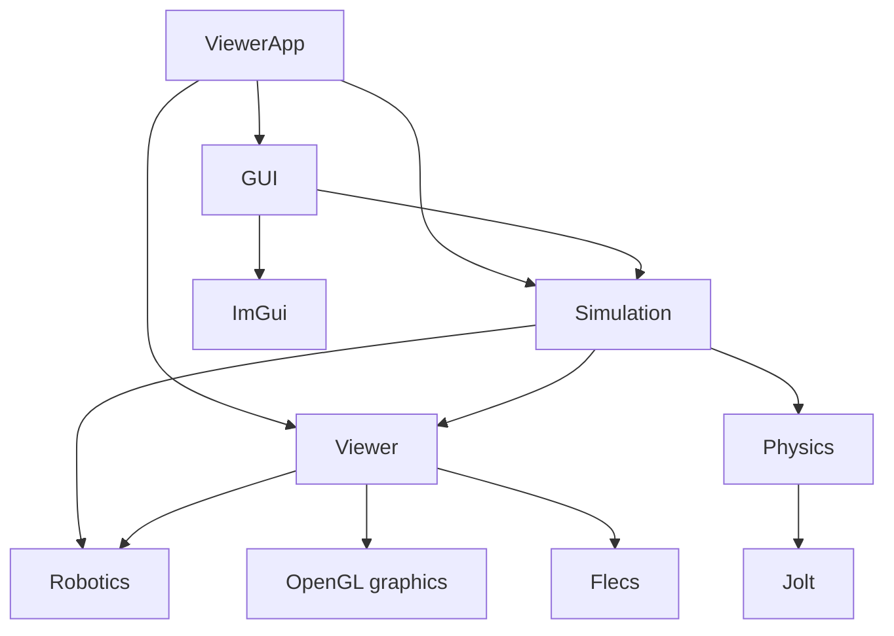

# Architecture

## Module boundaries

```text
modules/
├── robotics/       Robot models, controller contracts, backends, forward kinematics
├── physics/        Jolt wrapper and engine-independent physics types
├── viewer/         Flecs scene, transforms, GLB assets, OpenGL rendering
├── simulation/     Physics ECS integration, robot collision proxies, floor setup
└── gui/            ImGui panels and configured collider visualization
```

Arrows point from a consumer to its dependency. These are the main target dependencies in CMake:



`modules/physics` does not depend on Flecs, Viewer, or OpenGL. Jolt-specific types stay inside that module. `modules/simulation` owns Flecs physics configuration and the private runtime binding between an Entity and `PhysicsBodyHandle`.

## Robot state flow

```text
IRobotController
→ RobotState
→ RobotKinematics
→ RobotKinematicState
   ├── RobotTransformAdapter → GLB Joint Entity transforms
   └── RobotPhysicsAdapter → Kinematic link collision Entities
```

`RobotKinematics` is the shared source of robot pose. It derives parent-relative offsets from consecutive base-frame bind pivots and accumulates joint rotations for the serial chain. Viewer and Physics consume the same result instead of separately interpreting joint axes and angles. Robotics model data uses plain scalar/vector/quaternion types and does not depend on GLM, Flecs, or Jolt.

The FK output includes `toolFrameInBaseFrame` when the model defines a ToolFrame. This flange/model reference is separate from `RobotState::tcpPose`; `SimRobotController` leaves `tcpPoseValid` false. IK, `MoveLinear` execution, acceleration limiting, Gripper backends, and articulated dynamics remain unimplemented.

`RobotTransformAdapter` maps pose data onto the authored GLB hierarchy. `RobotPhysicsAdapter` builds per-link Convex Hulls from connected GLB pieces, stopping at downstream moving joints and Gripper. It uses triangle-centroid cells of 16 cm, excludes parts smaller than 4 cm and cells smaller than 1 cm, and retains only hull inputs with volume. `ConfigureTwoF85Colliders` adds seven Gripper-layer Kinematic proxy children under the authored fixed Gripper or moving joint Entity. Each rigid part gets its own reduced convex hull from its named GLB mesh (outer knuckles include the attached finger mesh); the proxy's local origin is the owning body/joint origin. The authored ECS joints remain the pose source until a gripper backend exists, so the normal World transform update carries proxies through the hierarchy. The fixed Gripper base and moving linkage are covered; this does not add a robot Base collider, controller, FK, grasp behavior, or articulated dynamics.

`modules/gui` owns the ImGui context and panels. Configured collider outlines come from ECS settings, not Jolt body inspection. They use X-ray screen projections without depth testing and refresh every 100 ms while enabled, including on first display or resize.

## Transform and fixed-step flow

`TransformSystemModule::UpdateWorldTransforms()` is the shared Local-to-World transform calculation. The fixed-step loop applies robot pose, updates world matrices, synchronizes Kinematic bodies, steps Jolt, and writes Dynamic body results back to Entity Local transforms. The render frame refreshes world matrices before `RenderSystemModule` reads them.

```text
FixedControlLoop
→ RobotController Update
→ RobotKinematics
→ Viewer + Simulation pose adapters
→ TransformSystemModule World transforms
→ PhysicsSystemModule Entity-to-Physics
→ PhysicsWorld Step
→ PhysicsSystemModule Physics-to-Entity
→ Render frame: TransformSystemModule / RenderSystemModule
```

Physics uses fixed delta time and is independent of render FPS. Physics hierarchies require unit scale; only a Static Environment Entity's own visual scale is allowed. Collider dimensions and offsets are explicit meter values. Bodies with a Dynamic ancestor are rejected. Public body poses use the model/Entity origin; Jolt applies compound-shape center-of-mass offsets internally.

## Scene composition and lifetime

`ViewerApp` is the Composition Root. It creates Window, renderer, scene, controller, `PhysicsWorld`, adapters, `PhysicsSystemModule`, and `GuiModule` in dependency order. It owns no per-object creation APIs.

`SimulationSceneBuilder` configures the floor. Application-side `DebugSceneSetup` adds falling boxes and the robot demo command only with `--physics-demo`, in both Debug and Release. `PrefabFactory` builds visual Entities from GLB nodes. A single-primitive Node owns its render components directly; multi-primitive nodes use render child Entities. The GLB loader requires one node tree under the selected scene root and rejects sparse accessors, invalid byte ranges/strides, unsupported matrix transforms, cycles, and multiple parents.

`ViewerApp` owns Flecs World and PhysicsWorld. Physics integration objects and robot adapters are destroyed before those owners. Flecs removal observers delete the Jolt Body associated with a removed Entity.

Scene Entity creation requires an active SceneRoot. `SceneManager` creates the root before `OnEnter`, so constructors must defer Entity creation until activation. Shutdown removes adapters and Scene Entities while physics observers are live, then removes the integration objects and World. `ModelResource` also holds strong GPU Mesh references; it, AssetManager, shaders, and the renderer are released before the Window destroys the OpenGL context.

For more detail on collision layers, transform spaces, scale requirements, and deferred robot-physics work, see [Physics / Flecs Integration](PHYSICS_ECS_INTEGRATION.md).
