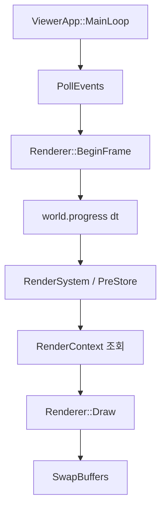
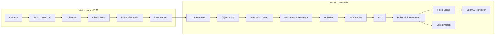
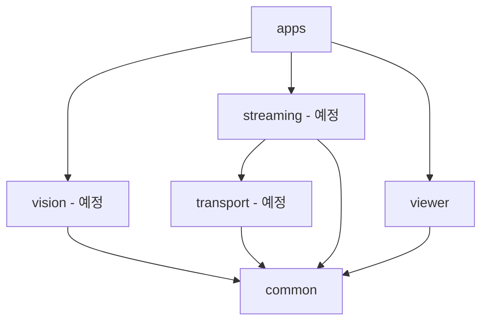

# PoseLink Architecture

## 1. 문서 목적

이 문서는 PoseLink의 **현재 구현 구조와 최종 목표 구조를 구분해서 설명하는 아키텍처 기준 문서**다.

코드와 문서가 충돌하면 코드를 우선한다. 아직 구현되지 않은 영역은 `예정`으로 표시한다.

---

## 2. 현재 구현 구조

현재 repository에서 확인되는 실제 build target은 `poselink_viewer`다.

```text
ViewerApp
├─ Window
├─ Renderer
├─ Camera
└─ flecs::world
   ├─ RenderContext
   ├─ Entity: Transform + Renderable
   └─ RenderSystem
```

현재 rendering loop:



`RenderContext`는 `Renderer*`, `Camera*`를 world context로 제공하고, `RenderSystem`은 `Transform + Renderable` entity를 query한다.

현재 `ViewerApp`에는 CubeA/CubeB 생성과 Flecs 기반 render loop가 구현되어 있다. `modules/vision`, `modules/transport`, `modules/streaming`, `apps/vision_node`의 주요 파일은 현재 master 기준으로 비어 있거나 CMake target에 연결되어 있지 않다.

> 프로젝트 진행 상태는 `Synthetic Pose → Cube` 완료로 관리한다. 다만 연결된 GitHub master snapshot에는 `SyntheticPoseSource` 구현과 Viewer 연결이 아직 반영되어 있지 않아, 이 부분은 작업 결과의 코드/문서 불일치 항목으로 남긴다.

---

## 3. 최종 시스템 구조



최종 목적은 단순 remote pose viewer가 아니라:

```text
Remote Object Pose
→ Simulation Object
→ Grasp Pose
→ IK
→ FK
→ Robot Arm
→ Kinematic Grasp
```

까지 연결하는 것이다.

---

## 4. 모듈 책임

| 모듈 | 현재 상태 | 책임 |
|---|---|---|
| `modules/common` | 일부 구현 | rendering/network에 종속되지 않는 domain type. 현재 `Pose.h` 존재 |
| `modules/viewer` | 구현 중 | OpenGL resource, `Transform`, `Renderable`, Flecs render system |
| `modules/vision` | 예정 | Synthetic/ArUco pose source |
| `modules/transport` | 예정 | UDP socket과 binary protocol |
| `modules/streaming` | 예정 | receiver, sequence 분석, pose buffer/interpolation |
| Robot kinematics module | 미정 | robot model, FK, IK, grasp 관련 계산. 경로/이름은 아직 결정하지 않음 |

현재 존재하지 않는 robot module 경로나 class 이름을 문서에서 확정하지 않는다.

---

## 5. 의존 관계

기본 방향:



경계 원칙:

- `common`은 OpenGL, OpenCV, Flecs를 알지 않는다.
- `vision`은 Viewer `Transform`을 직접 수정하지 않는다.
- `transport`는 OpenGL이나 robot model을 알지 않는다.
- `Renderer`는 Pose protocol을 해석하지 않는다.
- FK/IK는 rendering API에 종속시키지 않는다.
- Vision Node는 OpenGL/Flecs를 링크하지 않는다.

---

## 6. 데이터 모델 경계

### Pose

`modules/common/include/Pose.h`

```text
Position3D
Quaternion
Pose
```

Vision/network domain에서 사용하는 6DoF 상태다.

### Transform

`modules/viewer/include/components/Transform.h`

```text
position : glm::vec3
rotation : glm::quat
scale    : glm::vec3
```

Viewer/world rendering 상태다.

따라서 경계에서 명시적으로 변환한다.

```text
Pose
→ Viewer/application boundary
→ Transform
```

Robot 단계에서도 `Object Pose`, `Grasp Pose`, `End Effector Pose`, `Link Transform`을 같은 의미로 섞지 않는다.

---

## 7. 로드맵별 데이터 흐름

### 1. Synthetic Pose → Cube — 현재 단계

```text
Synthetic Pose
→ Pose
→ Viewer Transform
→ Flecs Entity
→ RenderSystem
→ Renderer
```

목적: 외부 입력 Pose가 렌더링까지 전달되는 경로를 network/vision 없이 검증.

### 2. UDP Object Pose — 다음 단계

```text
Synthetic Sender Process
→ Encode
→ UDP
→ Decode
→ Object Pose
→ Viewer Transform
```

목적: process/network 경계만 추가하고 기존 local 결과와 동일한지 확인.

### 3. ArUco Object Detection

```text
Camera
→ ArUco corners
→ solvePnP
→ Object Pose
→ 기존 UDP Publisher
```

Synthetic과 ArUco가 동일한 이후 pipeline을 사용하게 한다.

### 4. Simulation에 Object 생성

수신 Pose를 단순 Cube 테스트가 아니라 실제 tracked object entity의 world transform으로 적용한다.

### 5~6. Robot Model + FK

```text
Joint Configuration
→ Local Link Transform
→ Parent Transform 누적
→ World Link Transform
→ End Effector Pose
```

IK보다 먼저 FK correctness를 고정한다.

### 7. Grasp Pose

```text
T_base_grasp
=
T_base_camera
× T_camera_object
× T_object_grasp
```

`T_object_grasp`는 known object에 대해 사전 정의한다.

### 8~9. IK + Tracking

```text
Target Grasp Pose
→ IK
→ Joint Angles
→ FK
→ End Effector Pose
→ Error
```

### 10. Object Attach

초기에는 physics contact가 아니라 kinematic 조건을 사용한다.

```text
position error <= threshold
AND
orientation error <= threshold
→ grasp success
→ object follows end-effector transform
```

수치 threshold는 실제 구현 전에 `ACCEPTANCE_CRITERIA.md`에서 확정한다.

### 11. Network Jitter/Loss

robot grasp 경로가 ideal condition에서 정상 동작한 뒤 network impairment를 주입한다.

---

## 8. Flecs 사용 범위

현재 Flecs는 Viewer object 관리와 system scheduling에 사용한다.

실제 코드:

- `apps/viewer/ViewerApp.cpp`
- `modules/viewer/include/RenderContext.h`
- `modules/viewer/include/components/Transform.h`
- `modules/viewer/include/components/Renderable.h`
- `modules/viewer/src/systems/RenderSystem.cpp`

현재:

```text
world.set<RenderContext>()
world.import<RenderSystem>()
world.progress(dt)
```

`RenderSystem`은 `PreStore` phase에서 실행된다.

향후 robot link hierarchy에 Flecs relationship/`ChildOf`를 사용할 수 있지만, 실제 robot model 구조가 정해진 뒤 결정한다.

---

## 9. Thread / ownership

### 현재 Viewer

현재 Viewer loop는 main thread에서 window event와 rendering을 수행한다.

OpenGL context 생성/사용/해제도 동일 thread에 귀속한다.

`ViewerApp::Shutdown()`은 world를 먼저 reset하여 `Renderable`이 가진 GPU resource가 OpenGL context가 살아 있는 동안 해제되게 한다.

### 예정 Vision Node

초기에는 단일 thread를 우선한다.

```text
Capture
→ Detect
→ Pose
→ Send
```

성능 측정 후 필요할 때만 producer/consumer를 분리한다.

```text
Capture + Vision Worker
→ bounded pose queue
→ UDP Sender
```

오래된 Pose가 지연을 쌓지 않도록 bounded queue와 freshness-first drop policy를 검토한다.

---

## 10. 다음 단계 전에 확정해야 할 것

`UDP Object Pose`를 구현하기 전에 최소 다음을 결정해야 한다.

1. UDP packet의 논리 field와 byte layout
2. quaternion field 순서 (`w,x,y,z` 또는 `x,y,z,w`)
3. timestamp를 이번 단계부터 넣을지, object pose payload만 먼저 보낼지
4. object ID가 1단계부터 필요한지
5. sender/receiver socket API를 Windows/Linux 공통 wrapper로 바로 만들지
6. local loopback 테스트와 별도 process 테스트의 성공 기준

상세 설계는 [protocol.md](protocol.md)와 [testing.md](testing.md)에서 관리한다.
