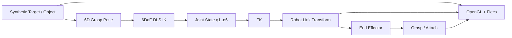

# GraspLink Architecture

## 1. 목적

GraspLink는 **하나의 C++ Simulator process 안에서 HCR-12A 기반 6DoF 로봇팔의 모델링, FK/IK, target 추종, grasp/attach를 구현하고 검증하는 프로젝트**다.

외부 Embedded Controller, serial/UDP 입력, Vision Node는 시스템 경계에 포함하지 않는다.

---

## 2. 시스템 경계



입력은 Simulator 내부 state로 관리한다. 향후 keyboard/GUI 조작을 추가하더라도 별도 transport/protocol layer를 만들지 않고 simulation state를 직접 갱신한다.

---

## 3. Robot Arm 모델

로봇팔은 **HCR-12A 기반 6DoF serial manipulator + 2F85 gripper**로 고정한다.

```text
Base
└─ J1
   └─ Link1
      └─ J2
         └─ Link2
            └─ J3
               └─ Link3
                  └─ J4
                     └─ Link4
                        └─ J5
                           └─ Link5
                              └─ J6
                                 └─ Link6
                                    └─ End Effector
                                       └─ 2F85 Gripper
```

J1~J6은 revolute joint이며 origin/axis/limit는 kinematics 계층의 `RobotSpecification`에서 명시한다.

---

## 4. Robot asset과 kinematics 분리

GLB는 시각 자산이고 joint hierarchy의 source of truth가 아니다.

```text
RobotSpecification
├─ J1~J6 origin
├─ J1~J6 axis
├─ Joint limit
├─ Parent / Child link
└─ End Effector frame

RobotAsset
├─ HCR-12A assembly/mesh
└─ 2F85 gripper assembly/mesh
```

STEP→GLB 변환에서는 CAD assembly hierarchy와 local transform을 보존한다. 실제 6축 kinematic chain은 코드에서 별도로 정의한다.

그리퍼는 별도 GLB로 유지할 수 있다.

```text
T_world_gripper = T_world_ee × T_ee_gripper
```

---

## 5. 현재 구현 구조

```text
ViewerApp
├─ SimulatorConfig
├─ ForwardKinematics
├─ DampedLeastSquaresIkSolver
├─ GraspPoseCalculator
├─ GraspController
├─ CadVisualRig
├─ Window / Renderer / Camera
└─ flecs::world
   ├─ HCR-12A link entities
   ├─ TargetObject
   ├─ TCP debug entity
   └─ RenderSystem
```

외부 I/O receiver/sender는 없다.

---

## 6. Repository 책임

| 영역 | 책임 |
|---|---|
| `apps/viewer` | Simulator lifecycle, target state, scene orchestration |
| `modules/common` | Pose, JointState 등 공통 domain type |
| `modules/kinematics` | HCR-12A specification, FK, Jacobian, DLS IK, grasp |
| `modules/viewer` | OpenGL/Flecs scene 및 rendering |
| `assets` | shader, HCR-12A/2F85/object mesh |
| `tools/cad` | CAD→GLB preprocessing |
| `tests` | deterministic FK/IK/grasp 검증 |

---

## 7. Simulator update 흐름

```text
Simulation Target State
→ 6D Grasp Pose 계산
→ DLS IK
→ Joint Target q1..q6
→ Joint State Update
→ FK
→ Link / EE World Transform
→ Grasp Condition 평가
→ Attach / Release State Update
→ Render
```

IK가 실패하면 이전 유효 joint state를 유지하고 invalid transform을 scene에 적용하지 않는다.

---

## 8. FK/IK 경계

Kinematics module은 OpenGL/Flecs에 의존하지 않는다.

```text
Joint State q1..q6
→ RobotSpecification
→ FK / Jacobian / IK
→ Link1..Link6 / End Effector Transform
```

렌더링 계층은 계산된 transform만 소비한다.

---

## 9. Grasp

초기 grasp는 physics contact가 아닌 kinematic 조건을 사용한다.

```text
position error <= threshold
AND
orientation error <= threshold
→ Object Attach
```

Attach 이후 object는 End Effector에 대한 relative transform을 유지한다.

---

## 10. Flecs 사용 범위

Flecs는 scene entity/component와 rendering system scheduling에 사용한다. FK/IK solver 자체는 ECS에 종속시키지 않는다.

---

## 11. 기본 구현/검증 순서

1. HCR-12A / 2F85 asset 정리
2. J1~J6 joint frame/limit 검증
3. FK reference pose 검증
4. End Effector / 6D Grasp Pose
5. Gripper mount
6. DLS IK 정확도/수렴성 검증
7. Joint trajectory/update
8. Synthetic target pose 조작 UI
9. Kinematic attach/release
10. Test / diagnostics / performance measurement

---

## 12. 기본 범위에서 제외

- ESP32 / MCU / RTOS
- UART / serial protocol
- UDP / socket protocol
- Camera / ArUco / OpenCV
- ROS2
- 외부 실로봇 제어
- collision-free motion planning
- rigid-body dynamics / contact physics
- torque control
