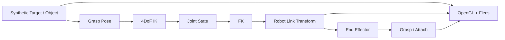

# GraspLink Architecture

## 1. 목적

GraspLink는 **하나의 C++ Simulator process 안에서 4DoF 로봇팔의 모델링, FK/IK, target 추종, grasp/attach를 구현하고 검증하는 프로젝트**다.

외부 Embedded Controller, UDP 입력, Vision Node는 시스템 경계에 포함하지 않는다.

---

## 2. 시스템 경계



입력은 Simulator 내부에서 생성하는 deterministic target/object state로 시작한다.

---

## 3. Robot Arm 모델

로봇팔은 **4DoF serial manipulator + gripper**로 고정한다.

| Joint | Motion | 역할 |
|---|---|---|
| J1 | Base yaw | 수직축 기준 회전 |
| J2 | Shoulder pitch | 상완 링크 회전 |
| J3 | Elbow pitch | 전완 링크 회전 |
| J4 | Wrist pitch | 접근 각도 조정 |
| Gripper | Open / Close | 별도 actuator/state |

초기 IK의 주 목표는 target XYZ와 wrist pitch다. full 6DoF pose IK는 기본 범위가 아니다.

---

## 4. Robot asset과 kinematics 분리

GLB는 시각 자산이고 joint hierarchy의 source of truth가 아니다.

```text
RobotDescription
├─ Joint origin
├─ Joint axis
├─ Joint limit
├─ Parent / Child link
└─ End Effector frame

RobotAsset
├─ Base mesh
├─ Link meshes
└─ Gripper mesh
```

CAD 변환 과정에서 node hierarchy가 사라지거나 vertex에 transform이 bake될 수 있으므로, kinematics는 코드/설정으로 명시적으로 관리한다.

그리퍼는 별도 GLB로 유지할 수 있다.

```text
T_world_gripper = T_world_ee × T_ee_gripper
```

`T_ee_gripper`는 고정 mount offset이다.

---

## 5. 현재 구현 구조

현재 실제 코드는 OpenGL/Flecs Viewer 기반이다.

```text
ViewerApp
├─ Window
├─ Renderer
├─ Camera
└─ flecs::world
   ├─ RenderContext
   ├─ Entity: Transform + Renderable
   └─ RenderSystem
```

현재 executable:

```text
grasplink_simulator
```

---

## 6. Repository 책임

| 영역 | 책임 |
|---|---|
| `apps/viewer` | Simulator lifecycle과 scene 구성 |
| `modules/common` | 공통 수학/domain type |
| `modules/viewer` | OpenGL/Flecs scene 및 rendering |
| 향후 robot module | RobotDescription, FK, IK, grasp 계산 |
| `assets` | shader, robot/object mesh |
| `tests` | deterministic kinematics/state 검증 |

외부 I/O 전용 module은 두지 않는다.

---

## 7. Simulator update 흐름

```text
Synthetic Target Update
→ Grasp Pose 계산
→ IK
→ Joint Target
→ Joint State Update
→ FK
→ Link / EE World Transform
→ Grasp Condition 평가
→ Attach / Release State Update
→ Render
```

IK가 실패하면 이전 유효 joint state를 유지하거나 명시적 failure state로 처리하며 NaN/비정상 transform을 scene에 적용하지 않는다.

---

## 8. FK 경계

FK는 rendering API에 의존하지 않는다.

```text
Joint State
→ RobotDescription
→ Link Transforms
→ End Effector Transform
```

렌더링 계층은 계산된 world transform만 소비한다.

---

## 9. Grasp

초기 grasp는 physics contact가 아닌 kinematic 조건을 사용한다.

```text
position error <= threshold
AND
wrist/grasp alignment error <= threshold
AND
gripper state == close
→ grasp success
→ Object Attach
```

Attach 이후 object는 End Effector 또는 Gripper에 대한 relative transform을 유지한다.

---

## 10. Flecs 사용 범위

Flecs는 scene entity/component와 rendering system scheduling에 사용한다.

```text
Entity
+ Transform
+ Renderable
+ optional RobotLink / Target / AttachedObject role component
```

FK/IK solver 자체는 Flecs나 OpenGL에 강하게 결합하지 않는다.

---

## 11. 기본 구현 순서

1. Synthetic Target/Object
2. Robot asset 정리
3. 4DoF hierarchy와 joint frame 정의
4. FK
5. End Effector / Grasp Pose
6. Gripper mount
7. IK
8. Joint update / trajectory
9. Target tracking
10. Kinematic attach/release
11. Test / diagnostics / performance measurement

자세한 순서는 [ROADMAP.md](ROADMAP.md)를 따른다.

---

## 12. 기본 범위에서 제외

- ESP32 / MCU / RTOS
- UDP / socket protocol
- Camera / ArUco / OpenCV
- ROS2
- 외부 실로봇 제어
- collision-free motion planning
- rigid-body dynamics / contact physics
- torque control
