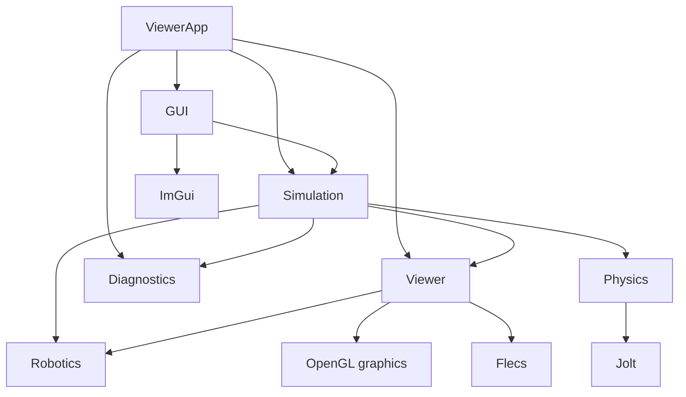

# Architecture

## Module boundaries

```text
modules/
├── diagnostics/   Asynchronous logs, numeric metrics, and profiling records
├── robotics/       Robot models, controller contracts, backends, forward kinematics
├── physics/        Jolt wrapper and engine-independent physics types
├── viewer/         Flecs scene, transforms, GLB assets, OpenGL rendering
├── simulation/     Physics ECS integration, robot collision proxies, floor setup
└── gui/            ImGui panels and configured collider visualization
```

Arrows point from a consumer to its dependency. These are the main target dependencies in CMake:



`modules/physics` does not depend on Flecs, Viewer, or OpenGL. Jolt-specific types stay inside that module. `modules/simulation` owns Flecs physics configuration and the private runtime binding between an Entity and `PhysicsBodyHandle`.

`modules/diagnostics` has no dependency on the simulation or graphics stack. `Logger` sends copied log and semantic metric records through a bounded queue to one file-writing thread. Tracy measures runtime zones and frames without routing timing records through Logger. `ViewerApp` owns the Logger longer than the systems that borrow it, then drains and joins the writer during shutdown. See [Diagnostics](DIAGNOSTICS.md) for the API and output format.

## Robot state flow

```text
IRobotController
→ RobotState
→ RobotKinematics
→ RobotKinematicState
   ├── RobotTransformAdapter → GLB Joint Entity transforms
   └── RobotPhysicsAdapter → Kinematic link collision Entities
```

`RobotKinematics` is the shared source of robot pose. It derives parent-relative offsets from consecutive base-frame bind pivots and accumulates joint rotations for the serial chain. Viewer and Physics consume the same result instead of separately interpreting joint axes and angles. Robotics model data uses plain scalar/vector/quaternion types and does not depend on GLM, Flecs, or Jolt.

Controller 호출 계약과 status/error 구분은 [Controller Interface](CONTROLLER_INTERFACE.md), HCR-12A 및 2F-85 수치의 출처 분류는 [Model Data Provenance](MODEL_DATA_PROVENANCE.md)와 [Simulation Specification](HCR12A_2F85_simulation_specs.md)을 참고한다.

FK는 모델에 ToolFrame이 있으면 `toolFrameInBaseFrame`을 제공한다. `DampedLeastSquaresIk`는 ToolFrame에 고정 공구 변환을 더해 TCP 목표를 만드는 관절각을 계산한다. `SimRobotController::MovePose`는 현재 자세 seed의 IK 결과를 관절 공간에서 검증해 이동하며, 미션은 비동기 `BeginPosePlanning`을 사용한다. MoveJ는 직접 관절 경로가 막힐 때 제한된 RRT-Connect를 시도하지만 TCP 직선은 보장하지 않는다. `MoveLinear`은 TCP의 직선 위치와 최단 회전 경로를 따라가며, 직전 표본 해를 seed로 이어갈 수 없을 때만 대체 IK 분기를 탐색한다. `tcpPoseValid=true`인 시뮬레이션 상태는 Robot base 기준 모델 FK 결과이며 실제 장치 측정값이 아니다. 관절과 TCP의 속도·가속도는 시뮬레이션 궤적 정책으로 제한하지만, 로봇 토크·질량·관성 기반 동역학은 구현하지 않았다. Hardware Gripper backend도 구현하지 않았다. 상세 계약은 [로봇 이동과 파지](ROBOT_MOTION_AND_GRASP.md)를 참고한다.

`RobotTransformAdapter`는 계산한 자세를 GLB 관절 계층에 적용한다. `RobotPhysicsAdapter`는 연결된 GLB 메시에서 각 링크의 Convex Hull을 만들고, 그리퍼 형상은 별도 설정 함수가 처리한다. Robot base에도 고정 Environment 충돌 형상을 둔다. `ConfigureTwoF85Colliders`는 GLB 메시를 축약한 hull로 Gripper-layer Kinematic proxy 7개를 만들며, 각 proxy의 위치는 소유 body 또는 joint를 기준으로 둔다. Robot과 Gripper의 충돌 프록시는 Kinematic이며 관절 동역학은 계산하지 않는다.

## 그리퍼 상태 흐름

```text
GUI 요청 → IGripperController / SimGripperController
→ GripperState.closureFraction
→ GripperKinematics: master angle / mimic Local rotation
→ GripperTransformAdapter: bind rotation * delta rotation
→ authored GLB 관절 → World 변환 → 기존 7개 Kinematic proxy
```

`GripperState`의 유효한 연속 위치가 개폐 자세의 기준이다. raw 0..255는 요청·표시용이며 반올림한 raw feedback을 기구학 입력으로 다시 사용하지 않는다. 여섯 관절은 분기형이므로 팔의 직렬 FK를 재사용하지 않고 Local 회전 변화만 계산한다. 어댑터는 원본 Local 위치·크기와 Gripper/ToolFrame 장착 변환을 보존한다. raw 위치의 선형 fraction 매핑과 master 속도 기본값 0.1..1.0 rad/s는 시뮬레이션 가정이다. `GripperGraspAdapter`는 물리 손끝 접촉으로 개폐를 정지시키고 양쪽 손끝이 같은 Dynamic 물체를 반대 방향에서 만지면 고정 constraint로 파지한다. 힘·전류·개별 손가락 적응은 계산하지 않는다. 자세한 계약은 [그리퍼 런타임 설계](GRIPPER_RUNTIME_DESIGN.md)를 참고한다.

`GuiModule`은 ImGui context·GLFW/OpenGL backend와 `BeginFrame/EndFrame`, 입력 capture 조회를 담당한다. `ViewerApp`이 `GripperPanel`, `PhysicsDebugPanel`, `ColliderOverlay`를 별도로 만들고 `BeginFrame → GripperPanel → PhysicsDebugPanel → ColliderOverlay → EndFrame` 순서로 조립한다. `GripperPanel`은 호출 중에만 Controller를 빌려 요청·상태를 표시하고, `PhysicsDebugPanel`은 collider 표시 체크박스 상태를 보관한다. `ColliderOverlay`는 World query와 화면 선 캐시를 소유하며 Camera는 Draw 호출 중에만 빌린다. 선은 Jolt 내부 형상 대신 ECS 설정의 깊이 없는 전경 투영이며, 첫 표시·resize와 100 ms 간격으로 갱신한다.

## Transform and fixed-step flow

`TransformSystemModule::UpdateWorldTransforms()`는 공통 Local-to-World 계산 경로다. 4 ms 고정 tick에서 두 Controller 상태와 팔·그리퍼 자세를 갱신한 뒤 World 행렬, Kinematic 동기화, Jolt step, Dynamic 결과의 Local 반영 순서로 진행한다. step 뒤 World 행렬을 다시 계산하며 렌더 직전에도 갱신한다.

`Rotation, Local`과 `NodeData.rotation`은 `glm::quat`이며 `Entity::GetLocalRotation` / `SetLocalRotation` 및 `ComposeLocalMatrix(position, rotation, scale)`도 quaternion을 사용한다. glTF 배열 `[x,y,z,w]`는 로더에서 GLM 생성자 `(w,x,y,z)`로 옮긴다. `Rotation` 생성과 행렬 합성은 회전을 검증·단위 정규화하며 영 quaternion·NaN·Infinity를 거부한다. `q`와 `-q`는 같은 회전이므로 성분 부호만으로 자세가 다르다고 판단하지 않는다.

팔·그리퍼 FK 결과는 quaternion으로 Entity에 전달한다. Dynamic은 SceneRoot 또는 항등 grouping 조상만 허용해 World≈Local 계약을 사용하므로, Physics 결과의 위치·quaternion을 Local에 직접 저장한다. 부모 역행렬이나 Local 행렬 분해는 하지 않는다. GLB·FK·Physics에서 quaternion과 Euler 사이의 왕복 변환을 제거했다. Entity pose·변환 행렬은 float 정밀도를 유지한다. 제어용 관절각과 각속도는 rad·rad/s 스칼라이며, Orbit 카메라의 마우스 입력용 yaw/pitch도 rad 각도를 사용한다.

```text
FixedControlLoop
→ GripperGraspAdapter BeforePhysicsStep: 파지 해제와 Body 수명 확인
→ RobotCollisionGuard CaptureSafeJointPose
→ RobotController + GripperController Update
→ RobotKinematics + GripperKinematics
→ Simulation pose adapters: GLB 관절과 Kinematic collision Entity 갱신
→ TransformSystemModule World transforms
→ RobotCollisionGuard: 후보 충돌 검사, 겹치면 안전 자세 복원
→ PhysicsSystemModule::Step
   ├─ PrePhysicsSync: 설정 재구성 / Scene-driven 목표 전달
   ├─ PhysicsWorld Step
   └─ PostPhysicsSync: Physics-driven Dynamic 결과를 Local에 직접 저장
→ GripperGraspAdapter AfterPhysicsStep: 접촉 피드백과 양쪽 파지 연결
→ TransformSystemModule World transforms 재갱신
→ Render frame: TransformSystemModule / RenderSystemModule
```

Physics는 render FPS와 독립된 고정 간격으로 진행한다. `IsSceneDriven`은 Static·Kinematic, `IsPhysicsDriven`은 Dynamic을 분류한다. Static은 Scene 목표가 바뀔 때만 `SetBodyTransform`을 호출한다. Kinematic은 같은 목표라도 실제 도달 전에는 `MoveKinematic`을 계속하고, 도달 뒤 `StopKinematic`을 한 번 호출해 잔류 속도를 지운 다음 같은 목표의 동기화를 생략한다. 위치·회전이 바뀌면 다시 이동한다. Kinematic 로봇은 환경과 겹쳐도 Jolt가 목표를 자동으로 막지 않는다. Controller의 경로 검사는 후보 자세를 사전에 검사하며, 각 fixed tick 뒤 guard도 다음 물리 step 전에 현재 Robot·Gripper 형상의 환경 또는 허용되지 않은 자가 충돌을 검사한다. 겹침이 있으면 직전 안전 관절 자세로 복원하고 오류 code를 기록한 채 Controller를 Idle로 둔다. 이는 Fault 상태 전이나 사전 충돌 회피 경로 계획이 아니다.

물리 Entity와 조상은 unit scale을 사용하며 Static Environment 자신의 시각 scale만 예외다. Collider 치수·offset은 m 단위로 직접 지정한다. 모든 Body는 Dynamic 조상을 금지하고, Dynamic 자체는 조상 각각의 변환이 항등이어야 한다. 실행 중 이 scale·부모 계약이 깨지면 binding과 Body를 제거하고, 복구되면 현재 Scene World 자세로 다시 만든다. 공개 pose는 model/Entity 원점 기준이며 compound의 무게중심 보정은 Jolt 내부 책임이다.

## Scene composition and lifetime

`ViewerApp` is the Composition Root. It creates Window, renderer, scene, controller, `PhysicsWorld`, adapters, `PhysicsSystemModule`, and `GuiModule` in dependency order. It owns no per-object creation APIs.

`grasplink_scene`, `grasplink_model_data`, and `grasplink_simulation` are built without OpenGL. The first owns Flecs Entities and transforms, the second loads CPU-side GLB data, and the third combines those with robotics and Jolt. Rendering, GPU asset upload, and the simulator window are added only when `GRASPLINK_BUILD_GRAPHICS` is enabled.

`ConfigureFloor` adds the fixed Box collider beneath the rendered floor. `PickPlaceScenario` creates the pick box and placement area used by the mission, while `grasplink::simulation::scenario` selects their reproducible positions and rotations. `PrefabFactory` builds visual Entities from GLB nodes. A single-primitive Node owns its render components directly; multi-primitive nodes use render child Entities. The GLB loader requires one node tree under the selected scene root and rejects sparse accessors, invalid byte ranges/strides, unsupported matrix transforms, cycles, and multiple parents. It reads only position, normal, and UV vertex attributes; the viewer does not implement normal mapping.

`ViewerApp`은 Flecs World와 PhysicsWorld를 소유한다. `ColliderOverlay`의 World query와 패널을 먼저 해제하고, 어댑터·Scene Entity를 제거한 뒤 Physics integration과 World를 정리한다. Flecs 제거 observer가 Entity의 Jolt Body도 삭제한다. `GuiModule`은 Window의 OpenGL context가 살아 있을 때 backend와 ImGui context를 정리한다.

`Scene` creates one SceneRoot on construction and removes its child Entities on destruction. The Viewer uses one Scene for its lifetime; there is no scene transition or per-scene update lifecycle. Shutdown removes adapters and Scene Entities while physics observers are live, then removes the integration objects and World. CPU-only `ModelResource` data is separate from GPU ownership. `AssetManager` caches GPU Meshes by resource ID and Entities keep shared MeshFilter references, so GPU resources are released before the Window destroys the OpenGL context.

The renderer keeps multisample antialiasing (MSAA) for smoother object edges and uses a single color pass. It does not allocate a shadow map or run a depth pass.

For more detail on collision layers, transform spaces, scale requirements, and deferred robot-physics work, see [Physics / Flecs Integration](PHYSICS_ECS_INTEGRATION.md).
