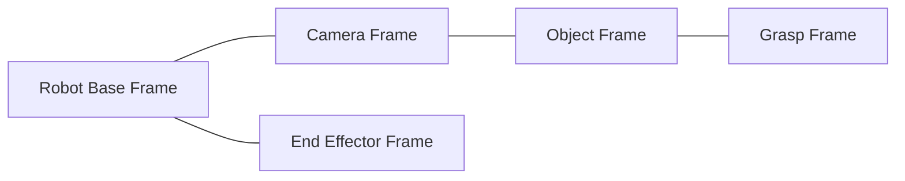

# 좌표계와 Pose 계약

PoseLink에서 좌표계는 Vision, Network, Viewer, Robot Kinematics를 연결하는 핵심 계약이다. 각 Pose가 **어느 frame을 기준으로 표현된 값인지**를 이름과 문서에서 명확히 한다.

## 1. 현재 코드의 Quaternion 순서

`modules/common/include/Pose.h`의 `Quaternion`은 다음 field 순서를 가진다.

```cpp
struct Quaternion
{
    float w;
    float x;
    float y;
    float z;
};
```

즉 현재 C++ domain type의 의미 순서는 `(w, x, y, z)`다.

`glm::quat`을 생성할 때도 constructor 인자는 `(w, x, y, z)` 순서를 사용한다.

Wire protocol의 field 순서는 별도 계약이므로 `protocol.md`에서 확정하고 encode/decode에서 명시적으로 변환한다.

---

## 2. 현재 Viewer 좌표계

현재 `Transform`은 GLM을 사용하며 Model Matrix를 다음 순서로 만든다.

```text
Model = Translation × Rotation × Scale
```

vertex에는 오른쪽부터 적용된다.

```text
Local
→ Scale
→ Rotation
→ Translation
→ World
```

현재 rendering은:

```text
clip = Projection × View × Model × local
```

구조를 사용한다.

Viewer에서 사용하는 일반적인 OpenGL view convention은:

```text
+X : right
+Y : up
-Z : camera forward
```

이다.

---

## 3. OpenCV Camera Frame — 예정

OpenCV camera frame은 일반적으로:

```text
+X : right
+Y : down
+Z : forward
```

`solvePnP` 결과의 `rvec`, `tvec`은 object/marker frame의 점을 camera frame으로 옮기는 변환을 나타낸다.

```text
X_camera = R_camera_object × X_object + t_camera_object
```

즉 object pose를 다음처럼 표기한다.

```text
T_camera_object
```

OpenCV 결과를 Viewer `Transform`에 그대로 대입하지 않는다.

---

## 4. 최종 프로젝트에서 필요한 Frame



### `T_camera_object`

원격 카메라가 추정한 object의 6DoF pose.

### `T_marker_object`

marker가 object 중심과 다르게 부착된 경우 미리 정의하는 고정 변환.

```text
T_camera_object
=
T_camera_marker × T_marker_object
```

### `T_object_grasp`

known object에 대해 end-effector가 도달해야 할 pose를 object frame 기준으로 정의한 고정 변환.

### `T_base_camera`

simulation에서 robot base와 camera frame의 상대 위치/방향.

실물 robot이 없더라도 simulation world에서 반드시 정의해야 한다.

### 최종 IK Target

```text
T_base_grasp
=
T_base_camera
× T_camera_object
× T_object_grasp
```

IK solver는 이 target pose에 end-effector를 맞추는 joint angle을 구한다.

---

## 5. Camera → Viewer 좌표 변환

OpenCV camera convention과 Viewer convention이 다르므로 명시적 basis conversion이 필요하다.

기본 변환 후보:

```text
C = diag(1, -1, -1, 1)
```

position:

```text
p_view = C × p_cv
```

rotation은 단순히 quaternion 일부 부호를 임의로 바꾸지 않고 basis change로 정의한다.

```text
R_view = C3 × R_cv × C3^-1
```

정확한 world/camera placement는 단계 3~4 구현 시 테스트와 함께 고정한다.

---

## 6. Robot Transform Hierarchy — 예정

Robot FK에서는 각 joint의 local transform을 부모 world transform과 누적한다.

```text
T_world_linkN
=
T_world_parent
× T_parent_linkN(qN)
```

최종 end-effector pose:

```text
T_base_ee(q)
```

IK 검증에서는:

```text
Target   = T_base_grasp
Current  = T_base_ee(q)
```

를 비교한다.

---

## 7. 단위

기본 공간 단위는 meter를 사용한다.

```text
position  : meter
angle     : radian (내부 계산 권장)
UI/log    : 필요 시 degree 변환
```

ArUco marker 실제 크기, robot link dimension, object grasp offset을 모두 같은 metric unit으로 유지한다.

---

## 8. 단계별 검증

### Synthetic Pose

- +X/+Y/+Z 이동이 화면에서 예상 축으로 움직이는지 확인
- Y축 quaternion 회전 방향 확인

### ArUco

- camera 오른쪽/아래/앞 이동에 대한 `tvec` 부호 확인
- marker 회전과 simulation object 회전 비교

### FK

- 모든 joint가 0일 때 reference pose 비교
- joint 하나씩 움직여 회전축과 부모-자식 누적 확인

### Grasp

- `T_object_grasp`를 object와 함께 시각화
- target frame과 end-effector frame을 debug axis로 비교

좌표계 검증 세부 항목은 `testing.md`에서 관리한다.
