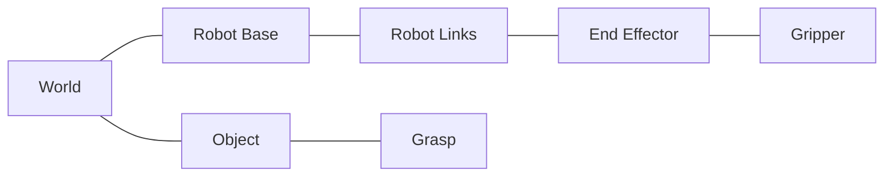

# 좌표계와 Transform 계약

GraspLink의 좌표계는 RobotDescription, FK, IK, Grasp, Rendering을 연결하는 핵심 계약이다. 각 transform이 어느 frame에서 어느 frame으로 가는 값인지 이름과 문서에서 명확히 한다.

## 1. 현재 Quaternion 순서

`modules/common/include/Pose.h`의 `Quaternion` 의미 순서는 `(w, x, y, z)`다.

`glm::quat` constructor도 `(w, x, y, z)` 순서를 사용한다.

---

## 2. Viewer 좌표계

현재 `Transform`의 Model Matrix는 다음 순서로 구성한다.

```text
Model = Translation × Rotation × Scale
```

vertex에는 오른쪽부터 적용된다.

```text
Local
→ Scale
→ Rotation
→ Translation
→ World
```

Rendering:

```text
clip = Projection × View × Model × local
```

일반적인 OpenGL view convention:

```text
+X : right
+Y : up
-Z : camera forward
```

RobotDescription의 실제 joint axis는 이 규약과 별도로 명시하며, asset import 후 basis가 다르면 한 번의 명시적 asset transform으로 맞춘다.

---

## 3. 기본 Frame



### `T_world_base`

World에서 Robot Base의 배치 transform.

### `T_parent_joint`

부모 link frame에서 joint origin까지의 고정 transform.

### `T_joint(q)`

joint angle `q`가 만드는 회전 transform.

### `T_base_ee(q)`

FK 결과인 Base→End Effector transform.

### `T_ee_gripper`

End Effector→Gripper 장착 위치/방향의 고정 mount transform.

### `T_world_object`

시뮬레이션 Object의 world transform.

### `T_object_grasp`

Object frame 기준의 Grasp target offset.

---

## 4. FK Transform Hierarchy

각 link transform은 부모 transform을 누적한다.

```text
T_base_linkN
=
T_base_parent
× T_parent_jointN
× T_jointN(qN)
× T_joint_linkN
```

RobotDescription 구조에 따라 고정 offset을 분리해서 표현한다.

최종 End Effector:

```text
T_world_ee
=
T_world_base × T_base_ee(q)
```

Gripper:

```text
T_world_gripper
=
T_world_ee × T_ee_gripper
```

---

## 5. Grasp Target

```text
T_world_grasp
=
T_world_object × T_object_grasp
```

IK는 `T_world_grasp` 또는 이를 Base frame으로 변환한 target을 사용한다.

```text
T_base_grasp
=
Inverse(T_world_base) × T_world_grasp
```

현재 End Effector:

```text
T_base_ee(q)
```

IK 검증은 target과 FK 결과의 position/alignment error를 비교한다.

---

## 6. 단위

기본 단위:

```text
position : meter
angle    : radian
UI/log   : 필요 시 degree 변환
```

CAD/GLB asset이 mm 단위로 들어오면 import/preprocess 단계에서 meter로 정규화한다. RobotDescription의 link dimension과 mesh scale은 같은 metric 기준을 사용한다.

---

## 7. Asset Transform 주의

CAD→GLB 변환 시 다음 정보가 사라질 수 있다.

- joint hierarchy
- pivot/origin
- parent-child 관계
- 의미 있는 node name

따라서 vertex의 현재 배치만 보고 joint frame을 추론하지 않는다. 필요한 경우 link별 mesh를 전처리하고 실제 joint origin을 RobotDescription에 별도로 기록한다.

---

## 8. 단계별 검증

### Robot Model

- Base/Link/EE에 debug axis 표시
- asset scale 확인
- reference configuration 확인

### FK

- 모든 joint가 기준값일 때 reference pose 비교
- joint 하나씩 움직여 axis와 parent-child 누적 확인

### Gripper

- `T_ee_gripper`가 End Effector 이동에 따라 일정하게 유지되는지 확인

### Grasp

- `T_object_grasp`를 Object와 함께 시각화
- target frame과 End Effector/Gripper frame을 debug axis로 비교

세부 검증은 `testing.md`에서 관리한다.
