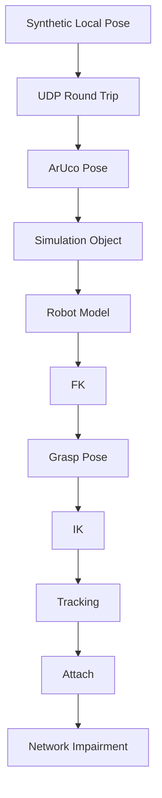

# Testing and Verification

## 1. 목적

PoseLink는 단계별로 다른 종류의 오류가 추가되므로 **한 번에 전체 시스템을 검증하지 않는다.**

로드맵 순서대로 입력 조건을 하나씩 늘리고, 이전 단계의 정상 동작을 기준으로 다음 단계에서 추가된 책임만 검증한다.

현재 automated test target은 master 기준으로 아직 구성되어 있지 않다. 아래 내용은 구현 단계별 검증 계약이다.

---

## 2. 전체 검증 전략



각 단계에서는 이전 단계의 구현을 최대한 재사용한다.

---

## 3. 단계 1 — Synthetic Pose → Cube

### 검증 대상

```text
Synthetic Pose
→ Pose
→ Transform
→ Flecs Entity
→ RenderSystem
→ Renderer
```

### 수동 검증

- X/Y/Z position 변화가 Cube 움직임으로 보이는가
- quaternion rotation이 예상 축/방향으로 적용되는가
- reference Cube가 있다면 synthetic Cube만 움직이는가
- frame pause 후 큰 `dt`가 clamp되는가

### 단위 검증 후보

Synthetic source가 time input을 받는 구조라면:

```text
Sample(t)
```

을 같은 `t`로 여러 번 호출했을 때 같은 Pose가 나오는지 확인한다.

### 실패 분리

```text
Pose 값 자체가 틀림
vs
Pose → Transform 변환이 틀림
vs
RenderSystem이 돌지 않음
vs
OpenGL rendering 문제
```

를 구분한다.

---

## 4. 단계 2 — UDP Object Pose

### Unit Test

#### Serialization Round Trip

```text
Pose
→ Encode
→ Decode
→ Pose'
```

검증:

- position field 일치
- quaternion field 일치
- sequence/timestamp를 넣었다면 값 일치

#### Known Byte Test

고정 입력을 넣고 byte layout이 예상 값과 동일한지 검증한다.

#### Invalid Packet

- wrong size
- wrong magic
- unsupported version
- NaN/Inf
- invalid quaternion

등을 넣어 reject되는지 확인한다.

### Integration Test

```text
Synthetic Sender Process
→ UDP loopback
→ Viewer
```

local direct trajectory와 UDP trajectory가 의미상 동일해야 한다.

---

## 5. 단계 3 — ArUco Object Detection

### Calibration 검증

- calibration file load
- camera matrix shape/value sanity check
- distortion parameter load

### Runtime 검증

- known marker detection
- marker ID 확인
- corner overlay 확인
- `solvePnP` 결과 finite 확인

### 방향 검증

카메라 기준으로 marker를:

```text
right
left
up/down
forward/backward
```

움직였을 때 position 변화 방향을 기록한다.

회전도 한 축씩 움직여 simulation과 비교한다.

### Detection Failure

marker를 가렸을 때:

- invalid state가 반환되는가
- 이전 pose를 새 detection처럼 계속 publish하지 않는가

---

## 6. 단계 4 — Simulation Object

검증:

- UDP 수신 Pose가 tracked object `Transform`에 적용되는가
- camera/object coordinate conversion 뒤 위치/방향이 예상과 일치하는가
- debug axis/reference object로 frame 방향을 확인할 수 있는가
- Vision/Transport가 `Renderer`에 직접 의존하지 않는가

---

## 7. 단계 5 — Robot Model

검증 체크리스트:

- robot model 출처/license 기록
- base frame 확인
- link 개수 확인
- joint 개수 확인
- joint axis 확인
- joint origin 확인
- joint limit 확인
- end-effector frame 확인
- mesh 단위/scale 확인

시각화에서는 각 link에 서로 다른 debug color/axis를 적용하면 hierarchy 오류 확인에 유리하다.

---

## 8. 단계 6 — FK

FK는 IK 전에 독립 검증한다.

### Reference Configuration

모든 joint를 reference angle로 두고 외부 reference pose와 비교한다.

### Single-Joint Test

한 번에 joint 하나만 움직인다.

```text
Joint 1 only
Joint 2 only
...
```

검증:

- 올바른 축으로 회전하는가
- child link가 함께 움직이는가
- parent link가 역으로 움직이지 않는가

### Chain Test

여러 joint angle을 동시에 입력하고 end-effector world pose를 reference implementation/known result와 비교한다.

### Invariant

- rotation matrix/quaternion 정상화
- NaN 없음
- rigid transform scale 변형 없음

---

## 9. 단계 7 — Grasp Pose

### Frame Composition Test

다음 식을 검증한다.

```text
T_base_grasp
=
T_base_camera
× T_camera_object
× T_object_grasp
```

### Visual Test

Object와 함께 grasp frame axis를 렌더링한다.

물체를 이동/회전했을 때 grasp frame이 항상 동일한 object-relative offset을 유지해야 한다.

---

## 10. 단계 8 — IK

### Reachable Target

known reachable grasp pose를 입력한다.

검증:

```text
IK target
→ q
→ FK(q)
→ end-effector pose
```

FK 결과가 target tolerance 안에 들어오는지 확인한다.

### Unreachable Target

workspace 밖 target을 넣어 solver가 실패 상태를 반환하는지 확인한다.

### Joint Limits

limit 밖의 solution을 그대로 적용하지 않는지 확인한다.

### Numerical Solver라면 추가 검증

- iteration limit
- singularity 근처 동작
- damping parameter
- convergence threshold
- position/orientation error weighting

을 명시한다.

---

## 11. 단계 9 — Grasp Pose 추종

움직이는 Synthetic Object를 먼저 사용한다.

검증:

- target pose가 매 update 변하는가
- IK가 update되는가
- FK link transform이 joint state와 일치하는가
- end-effector error가 추적 가능한 범위에서 안정되는가
- unreachable target에서 solver가 폭주하지 않는가

ArUco 입력은 그 다음 같은 pipeline에 넣는다.

---

## 12. 단계 10 — Object Attach

초기 attach는 kinematic이다.

### 성공 조건

```text
position error <= configured threshold
AND
orientation error <= configured threshold
```

### 검증

- threshold 밖에서는 attach되지 않음
- threshold 안에서 한 번만 attach transition 발생
- attach 순간 object world pose가 비정상적으로 튀지 않음
- attach 후 object가 end-effector relative transform을 유지
- release가 있다면 정상적으로 world ownership 복귀

---

## 13. 단계 11 — Network Jitter/Loss

### 비교 조건

같은 synthetic trajectory와 seed를 사용한다.

```text
A. Ideal
B. Immediate Network Pose
C. Buffered Interpolation
```

### Network 지표

- receive interval
- loss
- reorder
- duplicate
- queue/buffer occupancy
- pose age를 계산 가능한 환경에서는 pose age

### Robot 지표

- grasp target position/orientation error
- end-effector position/orientation error
- IK failure count
- grasp success/failure
- grasp condition 도달 시간

### 결과 원칙

buffering이 error를 줄여도 added latency를 함께 기록한다.

---

## 14. Memory / Lifetime 검증

장시간 반복 실행에서 확인:

- queue/buffer 무제한 증가 없음
- process 종료 시 worker join
- socket/camera 정상 close
- Viewer 종료 시 Flecs world가 GPU resource보다 먼저 정리되고 OpenGL context는 마지막까지 살아 있음

가능해지면 sanitizer를 사용한다.

```text
AddressSanitizer
UndefinedBehaviorSanitizer
ThreadSanitizer
```

플랫폼/compiler에 따라 지원 여부를 확인한다.

---

## 15. 현재 테스트 인프라 상태

현재 repository에는:

```text
tests/test_main.cpp
```

가 존재하지만 master 기준 내용은 비어 있고 root CMake의 test target으로 연결되어 있지 않다.

따라서 현재 `ctest` 통과를 구현 완료의 근거로 사용하지 않는다.

Protocol/FK/IK 단계부터 작은 deterministic unit test를 CMake에 추가하는 것이 우선순위가 높다.
